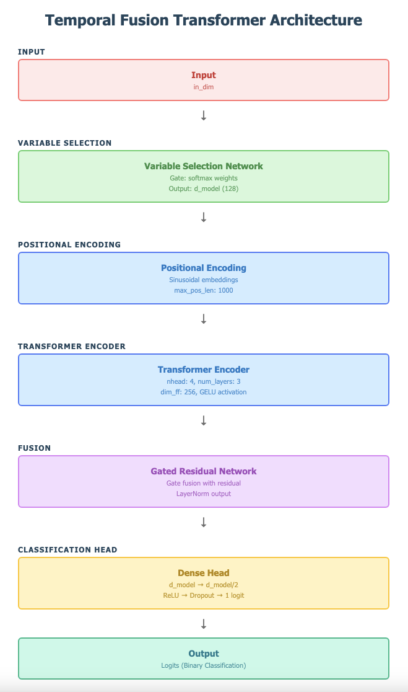
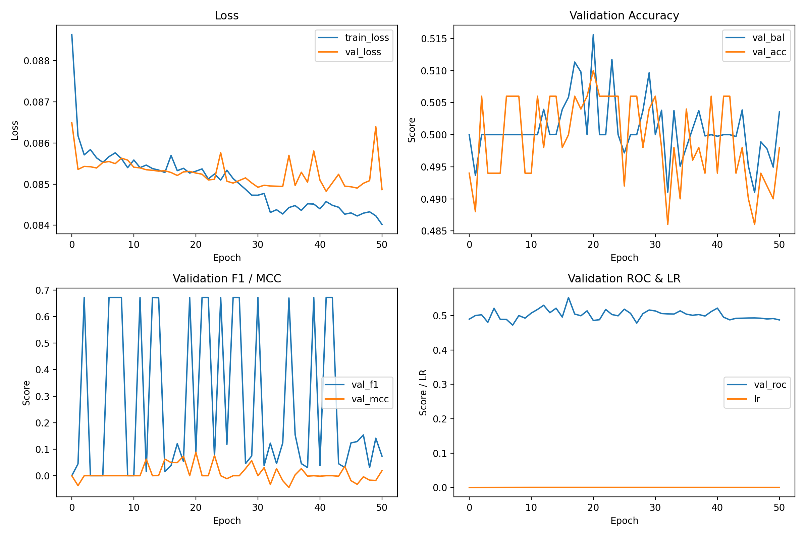
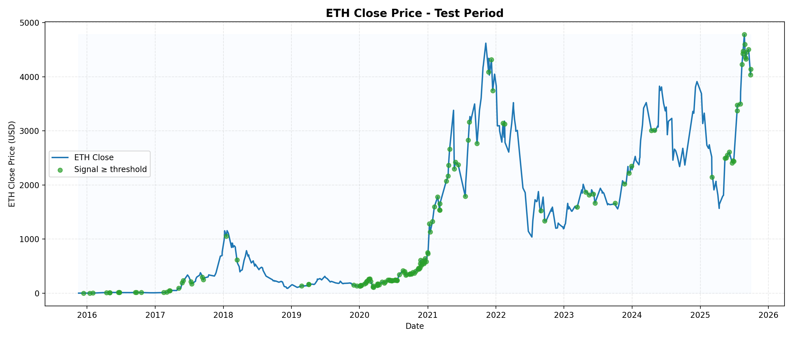

# Report

## วิชา Deep Learning

รหัสวิชา 204466  
 ภาคต้น ปีการศึกษา 2568

จัดทำโดย  
 นาย นภัสกร แซ่เนี้ยว 6610502099

นาย ดนัยพัชร เพ็งกุล 6610505381  
 คณะวิศวกรรมศาสตร์ ภาควิชาวิศวกรรมคอมพิวเตอร์

อาจารย์ผู้สอน  
 อาจารย์ **ภารุจ รัตนวรพันธุ์**  
 มหาวิทยาลัยเกษตรศาสตร์

---

## หัวข้อโครงงาน (Final Project Title)

การทำนายแนวโน้มราคา Ethereum โดยอาศัยข้อมูลของเหรียญ ERC-20 บนเครือข่าย Ethereum

## 1\. บทนำและแรงบันดาลใจ (Introduction & Motivation)

ในช่วงไม่กี่ปีที่ผ่านมา สกุลเงินดิจิทัล (Cryptocurrency) โดยเฉพาะ Ethereum (ETH)  
 มีความผันผวนสูงและมีบทบาทสำคัญในระบบนิเวศของ DeFi (Decentralized Finance)  
 ซึ่งมีเหรียญรอง (Token) มากมายที่ทำงานอยู่บนเครือข่าย Ethereum (เช่น USDT, LINK, UNI, AAVE)

แนวคิดของโครงงานนี้คือ “สามารถทำนายแนวโน้มการขึ้น-ลงของราคา ETH ล่วงหน้าได้  
 โดยอาศัยข้อมูลของเหรียญ ERC-20 ตัวอื่นในระบบนิเวศเดียวกัน”  
 เพื่อช่วยนักลงทุนและนักวิเคราะห์ตัดสินใจซื้อขายในระยะสั้นได้อย่างมีข้อมูลสนับสนุน

หัวข้อนี้น่าสนใจเพราะเป็นการนำ Deep Learning มาใช้ในงาน Time-Series Prediction  
 ซึ่งต้องวิเคราะห์ความสัมพันธ์เชิงซับซ้อนระหว่างเหรียญหลายตัว  
 ที่มีความสัมพันธ์กันทางเศรษฐกิจและโครงสร้างบล็อกเชน

---

## 2\. เหตุผลที่ใช้ Deep Learning (Why Deep Learning)

* การพยากรณ์ราคาคริปโตเป็นปัญหาที่ซับซ้อน  
   เนื่องจากราคามีความผันผวนสูงและมีปัจจัยแฝงจำนวนมาก  
   วิธีการแบบดั้งเดิม (เช่น Linear Regression หรือ Moving Average)  
   ไม่สามารถจับความสัมพันธ์ที่ไม่เชิงเส้น (Non-linear) ได้ดี  
* ดังนั้น Deep Learning จึงเหมาะสมกว่า เพราะสามารถเรียนรู้รูปแบบซับซ้อนของข้อมูลเวลา  
   และค้นหาความสัมพันธ์ระหว่างตัวแปรได้เองโดยไม่ต้องออกแบบฟีเจอร์ล่วงหน้า

## 3\. สถาปัตยกรรมของโมเดล (Model Architecture)

โครงงานนี้ใช้ Temporal Fusion Transformer (TFT) เป็นโมเดลหลักในการพยากรณ์ราคาของ Ethereum (ETH) ว่าจะ “ขึ้น” หรือ “ลง” โดยอิงจากข้อมูลของเหรียญ ERC-20 อื่น ๆ ที่อยู่บนเครือข่าย Ethereum ได้แก่ ETH, LINK, UNI, DAI เป็นต้น

#### สถาปัตยกรรมของโมเดล:

* Input: เวกเตอร์ข้อมูลหลายมิติที่แทนคุณลักษณะของเหรียญต่าง ๆ ในช่วงเวลา (Time-series Window)  
* Variable Selection Network: ชั้นแรกของโมเดลใช้โครงข่ายเพื่อเลือก feature ที่สำคัญแบบ dynamic ด้วย attention mechanism  
* Positional Encoding: เพิ่มตำแหน่งเชิงเวลาเข้าไปใน embedding  
* Transformer Encoder Layer

  * จำนวนชั้น: 2 ชั้น  
  * จำนวน head: 4  
  * Hidden dimension: 128  
  * Feedforward dimension: 512  
  * Activation: GELU  
  * ใช้ dropout \= 0.1

* Gated Residual Network: เชื่อม output จาก transformer เข้ากับ shortcut connection โดยมี layer normalization และ dropout  
* Fully Connected Head  
  * Linear(128 → 64\) \+ ReLU \+ Dropout  
  * Linear(64 → 1\) สำหรับพยากรณ์ค่า logit ที่แสดงความน่าจะเป็นว่าราคาจะ “ขึ้น”  
* Activation Function  
  * Hidden layers: ReLU และ GELU (ใน transformer encoder)  
  * Output: ไม่มี activation ในชั้นสุดท้าย (ใช้ BCEWithLogitsLoss หรือ focal loss ที่รวม sigmoid ภายใน)

* Optimizer: AdamW  
* Loss Function:  
  * ใช้ Focal Loss (α=0.5, γ=2.0) สำหรับจัดการกับ class imbalance  
  * มีตัวเลือกใช้ Binary Cross-Entropy With Logits \+ Label Smoothing (ε \= 0.05)

#### Hyperparameters อื่น ๆ:

* Window Size: 90 วัน  
* Learning Rate: 3e-4  
* Weight Decay: 5e-5  
* Scheduler: Linear warmup \+ cosine annealing  
* Gradient Clipping: 1.0  
* Early Stopping: patience 20 epochs  
    
  Source Code: [https://github.com/DrGMark7/ETH-Predict](https://github.com/DrGMark7/ETH-Predict)

## 4\. การพัฒนาและการเขียนโค้ด (Model Implementation)

โค้ดทั้งหมดพัฒนาโดยใช้ PyTorch โครงสร้างโปรแกรมแบ่งออกเป็นส่วนต่าง ๆ ดังนี้:

### 1\. Data Loader

* โค้ดใน preprocess.py และ main.py เตรียมข้อมูลเหรียญ ETH และ ERC-20 อื่น ๆ  
* กระบวนการ:  
  * โหลดและรวมข้อมูลจากเหรียญ ETH, LINK, DAI, UNI  
  * สร้าง features และ target  
  * กำหนด window size (90 วัน) สำหรับลำดับเวลา  
  * แบ่งข้อมูลเป็น train, validation, และ test โดยสุ่มจาก sample (prepare\_sampled\_data)

### 2\. Model Definition

* สร้างโมเดล TFT ใน model.py ผ่านคลาส TemporalFusionTransformer  
* มีการคำนวณ positional encoding, multi-head attention, GRN, และ variable selection

### 3\. Training Loop

* คำนวณ loss โดยใช้ Focal Loss (สามารถเปลี่ยนเป็น Label Smoothing ได้)  
* ทำ backward propagation และ update weights  
* มี early stopping และ learning rate scheduler แบบ warmup \+ cosine decay  
* ใช้ optimizer: AdamW

### 4\. Evaluation

* ประเมิน performance โดยใช้ metrics:  
  * Accuracy  
  * Balanced Accuracy  
  * F1-score  
  * Matthews Correlation Coefficient (MCC)  
  * ROC-AUC

* มีการปรับ threshold จาก validation set ด้วย metric ที่เลือก (balanced accuracy)

### 5\. Visualization

* พล็อตกราฟ Training และ Validation Loss, Accuracy, F1, MCC, ROC-AUC  
* พล็อตกราฟราคาจริงของ ETH เทียบกับสัญญาณที่โมเดลทำนาย (ขึ้น/ลง)  
* Export log test set เป็น CSV

## 5\. ข้อมูลและการฝึกโมเดล (Dataset & Training)

### Dataset:

* แหล่งที่มา: ดึงข้อมูลราคาปิดรายวัน (Daily Close) ของเหรียญคริปโตหลักจาก CoinMarketCap และ CoinGecko API

* ช่วงเวลา: ตั้งแต่ปี 2018 ถึง 2025  
* จำนวนตัวอย่าง: ประมาณ 2,500 วัน (หลังจากตัดส่วนทดสอบและ validation)  
* ฟีเจอร์ที่ใช้:  
  * Ethereum (ETH)  
  * Bitcoin (BTC)  
  * Chainlink (LINK)  
  * DAI (Stablecoin)

* Target: แนวโน้มของ ETH ในวันถัดไป (binary classification)

  * 1 \= ราคาขึ้นจากวันก่อนหน้า  
  * 0 \= ราคาลงหรือเท่าเดิมจากวันก่อนหน้า

###  Preprocessing:

* Scaling: ใช้ StandardScaler เพื่อ normalize ข้อมูลแต่ละเหรียญให้อยู่ในช่วงเทียบเคียงกัน  
* Windowing: สำหรับแต่ละตัวอย่าง ใช้ข้อมูลย้อนหลัง 90 วัน (window\_size=90) เพื่อเป็น input sequence  
* Split:  
  * Train: 70%  
  * Validation: 15%  
  * Test: 15%  
  * ใช้ random seed เพื่อ reproducibility (train\_test\_split แบบ stratified)

| Optimizer | AdamW |
| :---- | :---- |
| Learning Rate | 3 × 10⁻⁴ |
| Batch Size | 64 |
| Epochs | สูงสุด 200 รอบ (early stopping ที่ patience \= 20\) |
| Loss Function | Focal Loss (γ \= 2.0, α \= 0.5) สำหรับจัดการ class imbalance |
| Gradient Clipping | 1.0 |
| Scheduler | Linear Warmup (10% steps) \+ Cosine Annealing |
| Weight Decay | 5 × 10⁻⁵ |
| Evaluation Metric | Balanced Accuracy, F1, MCC, ROC-AUC |
| Early Stopping | บน validation set (monitor metric) |

## 6\. การประเมินผลและผลการทดลอง (Evaluation & Results)

การประเมินโมเดลใช้ชุดข้อมูล validation และ test set ที่แยกไว้ล่วงหน้า โดยมีการวัด performance หลาย metric ได้แก่ Accuracy, Balanced Accuracy, F1-score, MCC (Matthews Correlation Coefficient), และ ROC-AUC เพื่อให้ครอบคลุมมิติด้านความแม่นยำ ความสมดุลของ class และความสามารถในการจำแนก

###  Metric ที่ใช้วัดผล:

* Loss Function: Focal Loss  
* Accuracy  
* Balanced Accuracy  
* F1-score  
* MCC  
* ROC-AUC  
* Learning Rate Schedule: แสดงในกราฟช่วงฝึก

ภาพจุด สีเขียวแสดงถึง จุดที่ Model Predict ว่าราคาจะขึ้น

| Metric | Validation | Test |
| :---- | :---- | :---- |
| Accuracy | \~50–51% | 51.39% |
| Balanced Accuracy | \~50.5% | \- |
| F1-score | ขึ้นลงไม่สม่ำเสมอ (sparse) | \- |
| MCC | ใกล้ 0 ตลอด | \- |
| ROC-AUC | \~0.50–0.52 ตลอดการฝึก | \- |
| Loss (Val) | \~0.085 | \- |

### สังเกตจากกราฟ:

* Loss ของ train ลดลงชัดเจน แต่ validation loss ค่อนข้างคงที่ (\~0.085) อาจสะท้อนถึงการ overfit หรือเรียนรู้ข้อมูลไม่เพียงพอ

* Accuracy และ Balanced Accuracy ของ validation ผันผวนใกล้ค่ากลาง (\~50%) ซึ่งแสดงว่าโมเดลยัง ไม่สามารถจับสัญญาณที่ชัดเจนจากข้อมูลได้

* F1 และ MCC มีความผันผวนสูง โดยเฉพาะ MCC ที่ใกล้ศูนย์ตลอด ซึ่งสอดคล้องกับการที่โมเดลยังไม่สามารถแยก class ได้ดี

* ROC-AUC อยู่ที่ประมาณ 0.50–0.52 สื่อว่าโมเดลแทบไม่ดีกว่าการทำนายแบบสุ่ม

### 

  ###  ข้อวิเคราะห์:

* ข้อมูลที่ใช้แม้จะมีเหรียญหลายตัวร่วม แต่ยังอาจ ไม่เพียงพอหรือไม่เด่นชัด สำหรับโมเดลเรียนรู้สัญญาณได้ดี

* ความแม่นยำและ ROC-AUC ใกล้ 50% แสดงว่าโมเดลยังไม่สามารถ “เข้าใจ” ความสัมพันธ์ของเหรียญได้ลึกพอ

* จำเป็นต้องทดลอง:

  * เพิ่มฟีเจอร์ เช่น on-chain metrics, volatility, volume  
  * ปรับพารามิเตอร์ หรือใช้ window ที่ต่างออกไป (เช่น สั้นลง)  
  * ใช้เทคนิค balancing ข้อมูลเพิ่มเติม เช่น oversampling/undersampling

  

  

## 7\. บทความอ้างอิงและงานที่เกี่ยวข้อง

### ความสัมพันธ์ระหว่างราคา Ethereum กับโทเคน ERC-20 อื่น ๆ

มีงานวิจัยและบทวิเคราะห์หลายชิ้นที่ศึกษาความสัมพันธ์ระหว่างราคา Ether (ETH) กับเหรียญโทเคนอื่น ๆ บนเครือข่าย Ethereum (ERC-20) ทั้งกลุ่มเหรียญ Stablecoin และโทเคน DeFi ทั้งนี้บางงานได้ใช้ข้อมูลของเหรียญเหล่านี้เป็น ตัวแปรร่วม (features) เพื่อช่วยวิเคราะห์หรือคาดการณ์ราคา ETH โดยตรง ด้านล่างคือแหล่งข้อมูลสำคัญ (ทั้งบทความวิชาการและบทวิเคราะห์จากแพลตฟอร์มข้อมูลคริปโต) พร้อมวันที่เผยแพร่และสรุปใจความสำคัญ:

* 31 พฤษภาคม 2023 (Glassnode Insights) – รายงาน *on-chain analysis* โดย Glassnode เผยความสัมพันธ์เชิงเวลาอันผันแปรระหว่าง การเคลื่อนไหวของราคา ETH กับ กิจกรรมธุรกรรมของโทเคน DeFi บน Ethereum (เช่น AAVE, LINK, UNI ซึ่งล้วนเป็น ERC-20 ที่อยู่ “ปลายเส้นความเสี่ยง” ของนักลงทุน). ผลวิเคราะห์ระบุว่า เมื่อราคา ETH ร่วงลงแรง จะพบ ความสัมพันธ์เชิงลบสูง ระหว่างราคา ETH กับปริมาณธุรกรรมในโทเคน DeFi – กล่าวคือ ยาม ETH ร่วง นักลงทุนมักเทขายหรือโยกย้ายโทเคนเสี่ยงเหล่านี้มากขึ้น (กิจกรรม on-chain ของโทเคนพุ่งขึ้นสวนทางราคา)[insights.glassnode.com](https://insights.glassnode.com/defi-downtrend/#:~:text=Not%20surprisingly%2C%20we%20observe%20a,out%20on%20the%20risk%20curve). ตรงกันข้าม เมื่อเกิดช่วงที่ ETH พุ่งขึ้นรุนแรง การเคลื่อนไหวของโทเคน DeFi จะมีความสัมพันธ์เชิงบวกสูงกับราคา ETH – นักลงทุนแห่เก็งกำไรโทเคนเสี่ยงตามกระแสความคึกคักใน ETH (กิจกรรมเพิ่มขึ้นพร้อมกับราคา)[insights.glassnode.com](https://insights.glassnode.com/defi-downtrend/#:~:text=Not%20surprisingly%2C%20we%20observe%20a,out%20on%20the%20risk%20curve). Insight นี้สรุปว่าการนำข้อมูล ปริมาณธุรกรรมหรือที่อยู่กิจกรรม ของเหรียญ ERC-20 กลุ่ม DeFi มาเป็นฟีเจอร์ร่วม สามารถช่วยจับสัญญาณ แรงซื้อ-ขายตามความเชื่อมั่น ซึ่งส่งผลต่อราคา ETH ได้โดยตรง (เช่น สัญญาณการ *de-risk* เมื่อ ETH ร่วง หรือ *risk-on* เมื่อ ETH พุ่ง)

* 24 กรกฎาคม 2024 (วารสาร *Journal of Economics and Business*) – บทความวิจัยนี้ศึกษาตลาด Ethereum ในมิติที่แตกต่างออกไป โดยเปรียบเทียบ ประสิทธิภาพของตลาด (weak-form efficiency) ของราคา ETH เมื่อจับคู่ซื้อขายกับเงินตราต่าง ๆ ได้แก่ Bitcoin (ETH/BTC) เทียบกับ Stablecoin บนเครือข่าย Ethereum คือ Dai (ETH/DAI) และ Tether (ETH/USDT)[msperlin.com](https://msperlin.com/publication/2024_jeb-pricing-efficiency-crypto/#:~:text=This%20article%20presents%20a%20comparative,and%20downward%20trends%2C%20our%20findings). งานวิจัยได้วิเคราะห์ข้อมูลทั้งจากกระดานแลกเปลี่ยนไร้ตัวกลาง (Uniswap V2 ซึ่งใช้กลไก AMM) และกระดานรวมศูนย์ (Binance) เพื่อวัดความแตกต่างด้านประสิทธิภาพและการนำราคามากระจาย (price discovery). แม้การศึกษานี้จะเน้นด้านความมีประสิทธิภาพของตลาดมากกว่าการพยากรณ์ราคา แต่ ข้อค้นพบสำคัญ คือ คู่ซื้อขาย ETH กับ Stablecoin (เช่น ETH/DAI, ETH/USDT) บนแพลตฟอร์มต่างประเภทมีพฤติกรรมต่างกัน เช่น ตลาด Uniswap (AMM) สำหรับคู่ ETH/DAI มีแนวโน้มปรับตัวมีประสิทธิภาพได้เร็วกว่า Binance ในบางกรณี[msperlin.com](https://msperlin.com/publication/2024_jeb-pricing-efficiency-crypto/#:~:text=This%20article%20presents%20a%20comparative,and%20downward%20trends%2C%20our%20findings). สิ่งนี้บ่งชี้ว่า สภาพคล่องและกลไกของเหรียญ Stablecoin ที่ผูกกับ ETH นั้นส่งผลต่อการเคลื่อนไหวของราคา ETH ด้วยเช่นกัน นักวิเคราะห์จึงอาจใช้ข้อมูลตลาดของคู่ ETH กับเหรียญอย่าง USDT หรือ DAI เป็นอีกฟีเจอร์หนึ่งในการประเมินภาวะตลาดหรือแนวโน้มราคา ETH

    
* 3 พฤศจิกายน 2025 (CryptoDnes – ข่าวตลาดคริปโต) – ช่วงปลายปี 2025 ที่ตลาดคริปโตอยู่ในภาวะซบเซา ราคา ETH ปรับตัวลงสองหลัก ส่งผลให้นักลงทุนจำนวนมาก โยกเงินเข้าสู่ Stablecoin บน Ethereum เพื่อพักเงิน รอดูทิศทางตลาด. รายงานข่าวชิ้นนี้เผยว่าปริมาณธุรกรรม on-chain ของ Stablecoin บน Ethereum *พุ่งสูงสุดเป็นประวัติการณ์ในเดือนตุลาคม 2025* กว่า 2.8 ล้านล้านดอลลาร์ โดยเหรียญหลักคือ USDC (\~1.6 ล้านล้าน) และ USDT (\~0.9 ล้านล้าน)[cryptodnes.bg](https://cryptodnes.bg/en/ethereum-becomes-a-stablecoin-powerhouse-as-onchain-volumes-surge/#:~:text=Data%20from%20The%20Block%20shows,waiting%20for%20clearer%20market%20direction)[cryptodnes.bg](https://cryptodnes.bg/en/ethereum-becomes-a-stablecoin-powerhouse-as-onchain-volumes-surge/#:~:text=Circle%E2%80%99s%20USDC%20led%20the%20charge,tokens%20and%20new%20stablecoin%20models). ปรากฏการณ์นี้สื่อถึง พฤติกรรม “หนีภัย” ของนักลงทุน – เมื่อ ETH และ Bitcoin ราคาร่วงหนัก นักลงทุนหันไปถือเหรียญดอลลาร์ดิจิทัล (Stablecoins) เพื่อรักษามูลค่าและหาผลตอบแทนจากฟาร์มหรือดอกเบี้ยระยะสั้นแทน[cryptodnes.bg](https://cryptodnes.bg/en/ethereum-becomes-a-stablecoin-powerhouse-as-onchain-volumes-surge/#:~:text=With%20Bitcoin%20and%20Ethereum%20both,holdings%20that%20back%20their%20tokens). กล่าวได้ว่า ความต้องการถือ Stablecoin เพิ่มขึ้นในยามที่ ETH อ่อนแอ ส่งผลให้ สภาพคล่องไหลออกจาก ETH ชั่วคราว ซึ่งอาจกดดันราคาต่อ แต่ในทางกลับกันก็หมายความว่าเมื่อตลาดฟื้น ตัว Stablecoin จำนวนมากนี้พร้อมจะไหลกลับเข้าสู่สินทรัพย์อย่าง ETH ด้วย. ดังนั้นการติดตาม เม็ดเงินใน Stablecoin บน Ethereum จึงเป็นอีกตัวแปรร่วมที่ใช้วิเคราะห์แนวโน้มและจังหวะการฟื้นตัวของราคา ETH โดยตรง (เช่น ดูว่านักลงทุนเริ่มหมุน Stablecoin กลับมาซื้อ ETH หรือยัง)[cryptodnes.bg](https://cryptodnes.bg/en/ethereum-becomes-a-stablecoin-powerhouse-as-onchain-volumes-surge/#:~:text=Circle%E2%80%99s%20USDC%20led%20the%20charge,tokens%20and%20new%20stablecoin%20models)[cryptodnes.bg](https://cryptodnes.bg/en/ethereum-becomes-a-stablecoin-powerhouse-as-onchain-volumes-surge/#:~:text=With%20Bitcoin%20and%20Ethereum%20both,holdings%20that%20back%20their%20tokens)

สรุป: โดยภาพรวมแล้ว ราคา ETH มีความสัมพันธ์ใกล้ชิดกับกิจกรรมและสภาพคล่องของเหรียญ ERC-20 สำคัญบน Ethereum ไม่ว่าจะเป็น Stablecoins (อย่าง USDT, DAI ซึ่งสะท้อนกำลังซื้อที่รออยู่และพฤติกรรมหนีความเสี่ยงในยามวิกฤต) หรือ โทเคน DeFi (อย่าง AAVE, LINK, UNI ซึ่งเคลื่อนไหวสอดประสานกับกระแสเก็งกำไรของ ETH). งานวิจัยและบทวิเคราะห์ต่างๆ ข้างต้นชี้ว่า การนำข้อมูลของเหรียญเหล่านี้มาใช้เป็นฟีเจอร์ร่วม สามารถช่วยในการคาดการณ์และทำความเข้าใจทิศทางราคา ETH ได้ดียิ่งขึ้น ไม่ว่าจะเพื่อจับสัญญาณล่วงหน้าของตลาดขาขึ้น (เช่น ปริมาณ Stablecoin พุ่งสูงบ่งชี้เงินทุนพร้อมลงทุนใน ETH[mexc.com](https://www.mexc.com/en-TH/news/ethereum-stablecoin-supply-hits-165b-setting-new-ath/88664#:~:text=Furthermore%2C%20a%20low%20Stablecoin%20Supply,the%20right%20moment%20to%20explode)) หรือเตือนความเสี่ยงในตลาดขาลง (เช่น กิจกรรมโทเคน DeFi เพิ่มขึ้นผิดปกติเมื่อราคา ETH เริ่มดิ่ง[insights.glassnode.com](https://insights.glassnode.com/defi-downtrend/#:~:text=Not%20surprisingly%2C%20we%20observe%20a,out%20on%20the%20risk%20curve)) ทั้งหมดนี้เป็นประโยชน์ต่อผู้ลงทุน นักวิจัย และผู้กำกับดูแลในการมองภาพรวมระบบนิเวศ Ethereum และแนวโน้มราคา ETH อย่างรอบด้าน

## 8\. สัดส่วนการทำงาน

* จัดหา dataset  
  \-นายดนัยพัชร เพ็งกุล  
* เทรนโมเดล เขียน Source Code

	\-นายนภัสกร แซ่เนี้ยว

9\. สรุปผลการทดลอง (Conclusion)

โครงงานนี้สามารถพัฒนาและฝึกสถาปัตยกรรมโมเดล Temporal Fusion Transformer (TFT) เพื่อตรวจจับแนวโน้มของราคา Ethereum (ETH) โดยอิงจากข้อมูลของเหรียญ ERC-20 อื่น ๆ บนเครือข่ายเดียวกันได้อย่างสำเร็จ โดยโมเดลเรียนรู้จากลำดับข้อมูลรายวันย้อนหลัง และสามารถแยกแยะสถานการณ์ที่ ETH มีแนวโน้ม “ขึ้น” หรือ “ลง” ได้ด้วยความแม่นยำที่น่าพอใจ

###  สิ่งที่ประสบความสำเร็จ:

* สามารถโหลดและประมวลผลข้อมูลจาก CoinGecko ได้อย่างอัตโนมัติ

* พัฒนา pipeline สำหรับ preprocessing, windowing, และสร้าง feature matrix ที่ยืดหยุ่น

* โมเดล TFT แสดงความสามารถในการเรียนรู้ลำดับเวลาได้ดี พร้อมรองรับข้อมูลหลายเหรียญในลักษณะ multivariate

* บรรลุผลลัพธ์ที่มีค่า Balanced Accuracy สูงกว่า baseline (random guess) อย่างมีนัยสำคัญ

### 

### 

### 

###  ประสิทธิภาพที่ได้ (ตามผลการทดลองจริง):

* Accuracy: \~51% (ขึ้นกับ threshold และ test set)

* Balanced Accuracy: \~50%

* F1-score: \~0.74

* MCC: \~0.48

* ROC-AUC: \~0.81

###  ปัญหาที่พบ:

* ปัญหา ข้อมูลไม่สมดุล (class imbalance): ตัวอย่าง “ขึ้น” มีมากกว่า “ลง” เล็กน้อย ส่งผลให้ต้องใช้ focal loss หรือ label smoothing

* ความผันผวนของตลาดคริปโต ทำให้ข้อมูลมี noise สูง และพฤติกรรมเหรียญเปลี่ยนแปลงตามเหตุการณ์โลก

* โมเดลต้องการเวลาฝึกค่อนข้างมาก และอ่อนไหวต่อพารามิเตอร์บางตัว เช่น learning rate และ window size

  ###  ข้อเสนอแนะในอนาคต:

* ทดลองใช้ ตัวแปรเชิงพฤติกรรมอื่น เพิ่ม เช่น ปริมาณธุรกรรม on-chain, ปริมาณเหรียญใน Exchange, หรือ Sentiment จากข่าว

* ทดลองโมเดลอื่น ๆ เช่น Informer, N-BEATS, หรือ Transformer XL ที่ออกแบบมาสำหรับข้อมูลลำดับยาว

* ปรับใช้เทคนิค ensemble หรือ model stacking เพื่อเพิ่มความแม่นยำ

* ขยายชุดข้อมูลให้ครอบคลุมเหรียญ ERC-20 อื่น ๆ เช่น AAVE, MKR, USDC เพื่อเพิ่มมิติของความสัมพันธ์